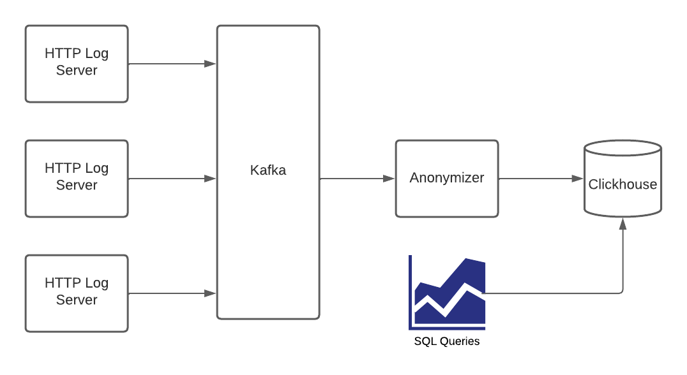

## REPORT (Submission)

### What this does
- End-to-end pipeline: Kafka → C++ anonymizer → ClickHouse via Nginx proxy (limited to 1 request per minute)
- IP anonymization: last octet to “X” (e.g., 1.2.3.4 → 1.2.3.X)
- At-least-once: Kafka offsets are committed only after a successful insert to ClickHouse
- Flush policy: send a batch roughly once per minute; when the topic is idle, a time-based flush still happens
- Data model: `logs.http_log` (raw) + `logs.http_log_agg` (SummingMergeTree) with a materialized view `logs.http_log_mv`

### Architecture (arrow-by-arrow)

1) Log Producer → Kafka (topic `http_log`)
- Cap’n Proto payload; producer rate controlled by `KAFKA_PRODUCER_DELAY_MS`.
- Failure: broker down/slow — producer retries.
- Observability: Kafka‑UI (topic present), Prometheus JMX target UP.

2) Kafka → Anonymizer (consumer)
- Manual offset control; decode → anonymize IP → build JSONEachRow line; accumulate into a batch.
- Time-based flush runs even when no new messages arrive.
- Observability: anonymizer logs, Kafka lag.

3) Anonymizer → Nginx proxy (1 req/min) → ClickHouse HTTP
- Insert with JSONEachRow into `logs.http_log`.
- 503 from proxy means “too early”; anonymizer waits until the next window and retries.
- Offsets are committed only after a successful flush (at‑least‑once).

4) Kafka → JMX Exporter → Prometheus → Grafana (Kafka dashboards)
- Broker health & performance (latencies, idle %, RPS, queue sizes).

5) ClickHouse → Grafana (HTTP Log Overview)
- Rows/bytes per minute, status mix, top URLs.

6) Kafka → Kafka‑UI (optional)
- Convenience to inspect topics, consumer groups and lag.

### SQL summary
- `logs.http_log` → MergeTree, `PARTITION BY toYYYYMMDD(timestamp)`, `ORDER BY (timestamp, resource_id, response_status, cache_status, remote_addr)`.
- `logs.http_log_agg` + MV `logs.http_log_mv` → `sum(bytes_sent)`, `count()` for fast aggregations.

### Real numbers from my run
(collected via `clickhouse-client`)

- Total rows / last event time:
  - rows: **10,985**
  - last_ts: **2025‑08‑10 11:55:35**

- Rows per minute (last 15m; sample):
  - 11:44 5, 11:45 5, 11:46 5, 11:47 5, 11:48 6, 11:49 5, 11:50 3, 11:51 4, 11:52 6, 11:53 2, 11:54 3, 11:55 1, 11:57 1

- Bytes per minute (last 15m; sample):
  - 11:45 3,031,295; 11:46 7,088,037; 11:47 6,213,006; 11:48 7,634,157; 11:49 3,283,334; 11:50 552,999; 11:51 5,652,298; 11:52 6,586,149; 11:53 2,755,195; 11:54 3,993,978; 11:55 2,873,050; 11:57 303,973

- Share by HTTP status (last 1h):
  - 301: 90, 502: 78, 404: 72, 504: 71, 500: 68, 400: 66, 200: 65, 403: 63

- Top URLs (examples, last 1h):
  - /media/category/s1yhzkfha18iibf7l — 1 row — 1,585,227 B
  - /a/data/category/data/9gp3ly.jpeg — 1 row — 421,704 B
  - /games/files/cdn/… .mpd — 1 row — 65,349 B

### Latency & durability (plain words)
- Because of the 1 req/min proxy, a batch is flushed roughly every **60–70 seconds** (window + network + CH). Occasional **503** is expected; the next attempt passes.
- **No data loss** in normal operation: offsets are committed only after a successful insert.
- Duplicates can appear only if a crash happens **after** the insert and **before** the commit. If consumers require dedupe, use **ReplacingMergeTree** keyed by `(topic, partition, offset)` or a dedup token (or aggregate from a deduped MV).

### How to run
- Start stack: `docker compose up -d`
- Run anonymizer:
  - foreground: `docker compose run --rm anonymizer`
  - background: `docker compose up -d anonymizer`
- Grafana: http://localhost:3000 (admin/kafka)

### Scaling & limits
- The main bottleneck is the **1 req/min** proxy. Options:
  - Raise the limit (e.g., 60 req/min) and flush smaller batches every second.
  - **Shard**: multiple proxies → sharded ClickHouse inserts by key (e.g., `resource_id`).
  - Buffer to an intermediate store (Kafka/local) and **INSERT SELECT** into ClickHouse.
- Kafka consumption can scale by increasing **partitions** and running multiple consumers (same `group.id`). Keep **one writer per proxy window** or coordinate writers (leader election) to avoid hitting the limit.
- ClickHouse can scale out with **ReplicatedMergeTree / Distributed** once a single node is not enough.
- Exactly‑once‑ish: use ReplacingMergeTree with a stable dedup key or `deduplicate_blocks=1`.

### Logical commit breakdown (for a clean history)
- **chore(infra)**: docker-compose stack (Kafka, ZK, ClickHouse, proxy, Prometheus, Grafana, Kafka‑UI, JMX)
- **feat(sql)**: ClickHouse schema & MV (`logs.http_log`, `logs.http_log_agg`, `logs.http_log_mv`)
- **feat(anonymizer)**: C++ consumer, Cap’n Proto decode, IP anonymization, JSONEachRow batch insert, manual commits
- **fix(anonymizer)**: idle flush (time-based flush also when topic is quiet); retry/backoff for 503
- **feat(grafana)**: provisioning (Prometheus & ClickHouse) + Kafka dashboards + HTTP Log Overview
- **docs(report)**: submission report with real numbers
- **chore(cleanup)**: remove duplicates & generated artefacts; tighten .gitignore

### Production readiness (tests I would add)
- Load tests around the 1 req/min limit: batch size, retries, end‑to‑end latency across producer rates
- Failure injection: CH/proxy downtime, network hiccups, Kafka restarts → verify recovery and at‑least‑once
- Duplicate scenarios: crash between insert & commit → validate dedupe strategy (ReplacingMergeTree/dedup token)
- Backpressure and memory under sustained spikes (with and without idle)
- Metrics & alerts: flush duration, retry spikes, lag; Grafana SLO panels
